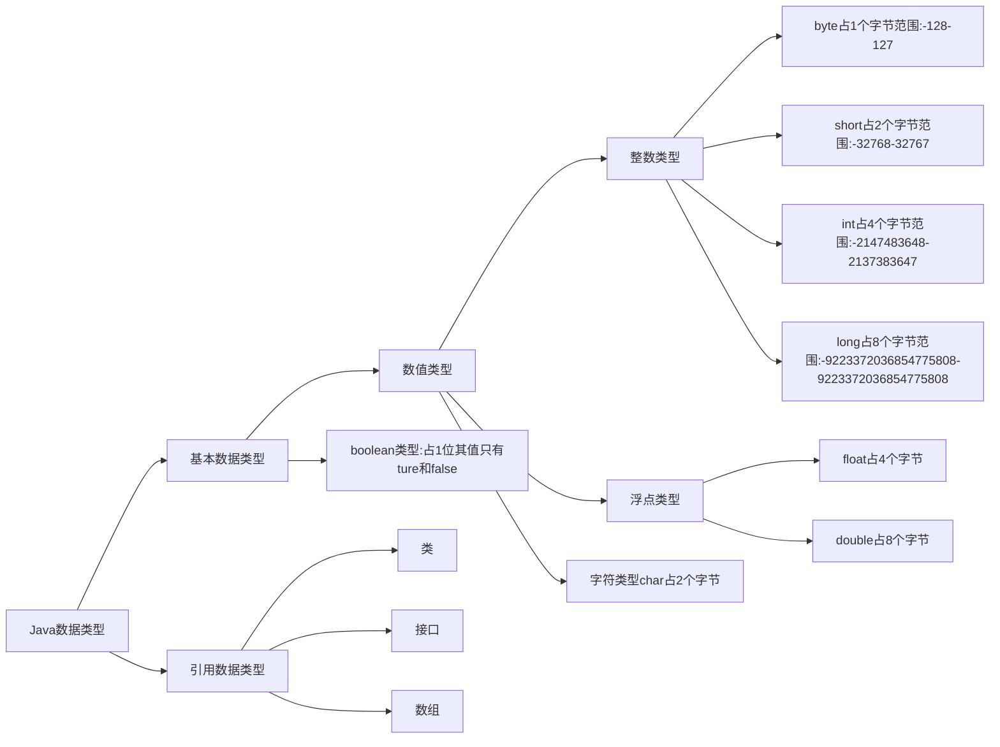

# Java基础


### Java注释：

```java
//单行注释

/*多行注释
  多行注释
  多行注释*/

/**文档注释
  *文档注释
  *文档注释
  */
```

### Java标识符：

所有的标识符都应该以字母（A-Z or a-z）美元符（$ ）或下划线（_）开始。

首字符之后可以是字母（A-Z or a-z）美元符（$ ）下划线（_）或数字组合。

标识符大小写敏感。

可使用中文。

### Java数据类型：

强类型语言：所有变量都必须先定义后才能使用。




```java
public class DATA {
    public static void main(String[] args) {
        //整数
        int num00 = 1;
        byte num01 = 1;
        short num02 = 1;
        long num03 = 1L;//long类型要在后面加L
        
        //小数
        float num04 = 1.1F;//float类型要在后面加L
        double num05 = 1.1111111;
        
        //字符
        char name = '圣母真言';
        String name = "圣母真言";//String不是关键字是一个类
            
        //布尔值
        boolean name = true;
        boolean name = false;
        if (name==ture){} 等效于 if (name){}
    }
}
```

### 类型转换：

```java
/*强制类型转换
  (类型)变量名 由高到低
  不能对布尔值进行转换
  不能把对象类型转换为不相干的类型
  把高容量转换到低容量低时候，强制转换
  转换的时候可能会存在内存溢出，或者精度问题
  */
int x = 1;
byte y = (int)x;

/*自动转换
  系统自动由低到高转换
  */
```

### 变量：


Java是强类型语言，每个变量都必须申明其类型。

Java变量是程序中最基本的储存单元，其要素包括变量名，变量类型和作用域。

每个变量都有类型，类型可以是基本类型，也可以是引用类型。

变量名必须是合法的标识符。

变量声明是一条完整的语句，因此每一个申明都必须以分号结束。

```java
public class noob {
    //实例变量：从属于对象
    String name = "";
    int age = 1;
    System.out.println(noob.name);
    System.out.println(noob.age);
    
    //类变量 static
    static double noob_x = 1111;
    
    //局部变量,必须申明和初始化值,存在与方法中
    public static void main(String[] args) {      //main方法
        int x = 1;
        System.out.println(x);
        System.out.println(noob_x);//输出类变量
    }
}
```

### 变量命名规则：

| 所有变量·方法·类名 | 见名知意                                |
| ------------------ | --------------------------------------- |
| 类成员变量         | 首字母小写和驼峰原则——noobTeam          |
| 局部变量           | 首字母小写和驼峰原则                    |
| 常量               | 大写字母和下划线——NOOB_Team             |
| 类名               | 首字母大写和驼峰原则——NoobTeam          |
| 方法名             | 首字母小写和驼峰原则——noob() noobTeam() |

### 常量：

常量名一般使用大写字符。

常量是特殊的变量。

```java
public class noob {
    public static void main(String[] args) {
        final double XY = 3.14;
        System.out.println(XY);
    }
}
```

### 运算符：

| 算数运算符     | +  -  *  /  %  ++  --          |
| -------------- | ------------------------------ |
| 赋值运算符     | =                              |
| 关系运算符     | >  <  >=  <= == !=  instanceof |
| 逻辑运算符     | && \|\|  !                     |
| 位运算符       | & \| ^ ~ >>  <<  >>>           |
| 条件运算符     | ? :                            |
| 扩展赋值运算符 | +=  -=  *=  /=                 |

```java
public class noob {
    public static void main(String[] args) {
        long x = 123123123123123L;
        int y = 123;
        short z = 10;
        System.out.println(x+y);//输出为long数据类型
        System.out.println(y+z);//输出为int
        //有long类型常与运算时输出结果为lone类型,无long类型参与运算时输出为int类型。
    }
}
```

```java
public class noob {
    public static void main(String[] args) {
		int x = 1;
        //x = x + 1
        int y = x++;//执行完这行代码后，给y赋值，在自增
        int z = ++x;//执行完这行代码前，自增，在给z赋值
        System.out.println(x);
        System.out.println(y);
        System.out.println(z);
    }
}
```

```java
public class noob {
    public static void main(String[] args) {
		boolean x = true;
        boolean y = false;
        System.out.println("x&&y"+x&&y);//逻辑与运算：两个变量都为真结果才为true
        System.out.println("x||y"+x||y);//逻辑或运算：两个变量有一个为真则结果为true
        System.out.println("!(x||y)"+!(x&&y));//如果是真则变为假，如果是假则反之
        
        //短路运算
        System.out.println(y&&x++);//其中y为假，程序判断y为假则不执行后面的x++运算
    }
}
```

```java
public class noob {
    public static void main(String[] args) {
        //位运算
		x = 0011 1100
        y = 0000 1101
        x&y = 0000 1100
        x|y = 0011 1101
        x^y = 0011 0001
        ~y  = 1111 0010
        <<相当于*2
        >>相当于/2
        System.out.println(2<<3);//输出为16
    }
}
```

```java
public class noob {
    public static void main(String[] args) {
		int x = 1;
        int y = 2;
        x+=b;//x=x+y
        x-=b;//x=x-y
        System.out.println(x);
        
        //字符串链接符:+
        System.out.println(""+x+y);//输出为12
        System.out.println(x+y+"");//输出为3
    }
}
```

```java
public class noob {
    public static void main(String[] args) {
		//三元运算符
        //x ? y ：z
        //如果x==true,则结果为y,反之结果为z
        int x = 50;
        String type = x < 60 ? "不及格" ： "及格";
        System.out.println(type);
    }
}
```

### 包机制：

一般利用公司域名倒置作为包名

```java
package NOOB;

import 包名

public class noob {
	
}
```

### JavaDoc：

javadoc是用来生成自己的API文档的

```java
package NOOB;

/**
 * @author 作者名
 * @version 版本号
 * @since 指明需要最早使用的jdk版本
 * @param 参数名
 * @return 返回值情况
 * @throws 异常抛出情况
 */

public class noob {
    
}
```

