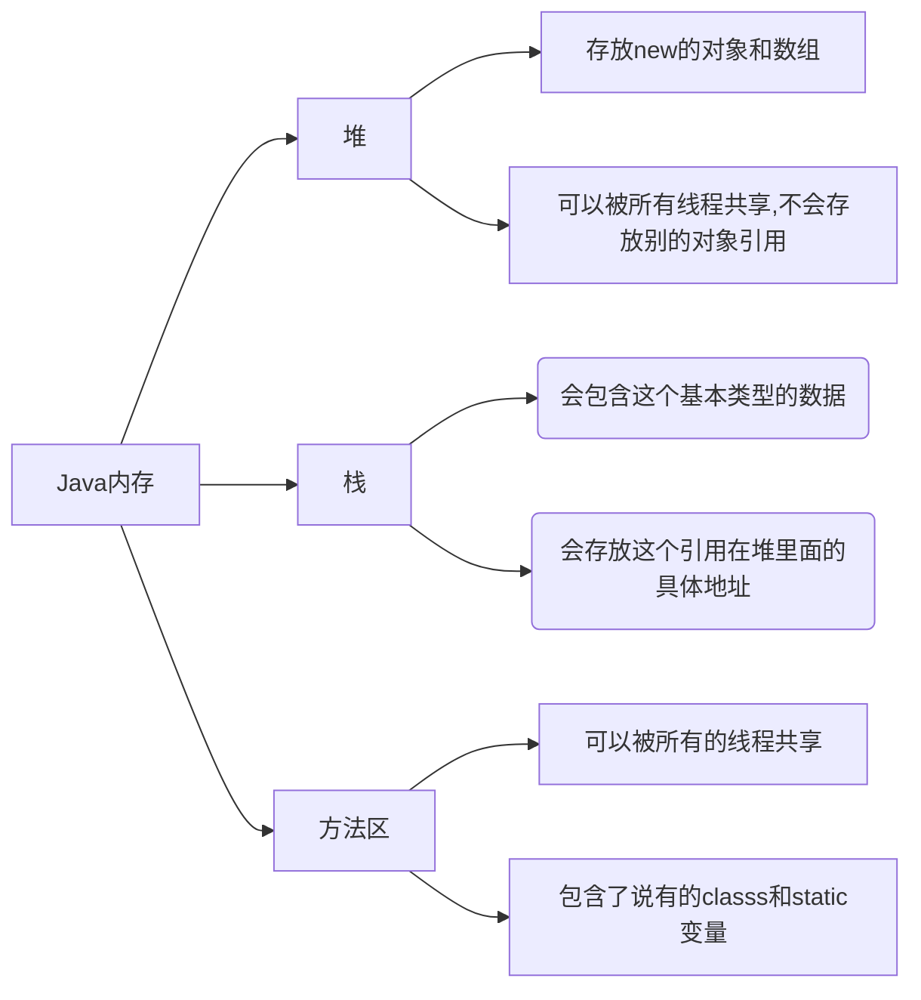

# Java数组


### 数组的声明和创建：

```java
int[] nums;//声明数组变量
nums = new int[10];//创建数组

//获取nums数组的长度
nums.length
```


### Java内存分析：




### 三种初始化

##### 静态初始化：

```java
int[] x = {1,2,3,4,5,6,7,8,9,10};
System.out.println(x[0]);
```

##### 动态初始化(包含默认初始化)：

```java
int[] x = new int[10];
x[0] = 10;
System.out.println(x[0]);
System.out.println(x[1]);//未赋值默认唯一
```

##### 数组的默认初始化：

数组是引用类型，它的元素相当于类的实例变量，因此数组一经分配空间，其中的每个元素也被按照实例变量同样的方式被隐私初始化。


### 数组的特点：

其长度是确定的，数组一旦被创建，它的大小就是不可改变的。

其元素必须是相同类型，不允许出现混合类型。

数组中的元素可以是任何数据类型，包括基本类型和引用类型。

数组变量属于引用类型，数组也可以看成是对象，数组中的每个元素相当于该对象的成员变量。

数组本身就是对象，Java中对象是在堆中的，因此数组无论保存原始类型还是其他对象类型，数组对象本身是在堆中的。


### 数组使用：

普通for循环

for-each循环

数组作方法入参

数组作返回值

```java
package noob;

public class Main {
    public static void main(String[] args) {
        int[] x = {1,2,3,4,5};
        int[] reverse = reverse(x);
        printArray(reverse);
        }
        //反转数组
        public static int[] reverse(int[] x){
        int[] result = new int[x.length];
        //反转操作
        for (int i = 0,j = result.length-1; i < x.length; i++,j--){
            result[j] = x[i];
        }
        return result;
    }
    //打印数组元素
    public static void printArray(int[] x){
        for (int i = 0;i < x.length; i++){
            System.out.print(x[i]+" ");
        }
    }
}
```


### 多维数组：

```java
//二维数组
package noob;

public class Main {
    public static void main(String[] args) {
     int[][] x = {{1,2},{3,4},{5,6}};
        System.out.println(x[1][0]);
    }
}
```


### Arrays类：

```java
package noob;

import java.util.Arrays;

public class Main {
    public static void main(String[] args) {
     int[] x = {1,2,3,4,9090,123123,456345,5678,123,34};
        Arrays.sort(x);//排序
        System.out.println(x);
        System.out.println(Arrays.toString(x));//Arrays.toString以默认排序输出
    }
}
```


### 冒泡排序：

冒泡排序的基本思想是：对比相邻的元素值，如果满足条件就交换元素值，把较小的元素值移动到数组前面，把大的元素值移动到数组后面（也就是交换两个元素的位置），这样数组元素就像气泡一样从底部上升到顶部。

```java
package noob;

import java.util.Arrays;

public class Main {
    public static void main(String[] args) {
        int[] a = {1,2,3,4,5,6,7,8};
        int[] sort = sort(a);
        System.out.println(Arrays.toString(sort));
    }

    public static int[] sort(int[] array){
        int temp = 0;
        for (int i = 0; i < array.length-1; i++) {
            boolean flag = false;
            for (int j = 0; j < array.length-1-i; j++) {
                if (array[j+1]>array[j]){
                    temp = array[j];
                    array[j] = array[j+1];
                    array[j+1] = temp;
                    flag = true;
                }
            }
            if (flag=false){
                break;
            }
        }
    return array;
    }
}
```


### 稀疏数组：

当一个数组中大部分元素为0 ，或者为同一个值的数组时，可以使用稀疏数组来保存该数组。

稀疏数组的处理方式：记录数组一共有几行，有多少个不同值。

​									  把具有不同值的元素和行列及值记录在一个小规模的数组中，从而缩小程序的规模。

```java
package noob;

public class Main {
    public static void main(String[] args) {

        //原始数组
        int[][] x1 =new int[11][11];
        x1[1][2] = 1;
        x1[2][3] = 2;
        System.out.println("原始数组：");
        for (int[] y : x1) {
            for (int z : y) {
                System.out.print(z+"\t");
            }
            System.out.println();
        }

        //获取有效值个数
        int sum = 0;
        for (int i = 0; i < 11; i++) {
            for (int j = 0; j < 11; j++) {
                if (x1[i][j]!=0) {
                    sum++;
                }
            }
        }
        System.out.println("有效值有"+sum+"个");

        //稀疏数组
        int[][] x2 = new int[sum+1][3];//构建稀疏数组
        x2[0][0] = 11;
        x2[0][1] = 11;
        x2[0][2] = sum;
        int count = 0;
        for (int i = 0; i < x1.length; i++) {
            for (int j = 0; j < x1[i].length; j++) {
                if (x1[i][j]!=0) {
                    count++;
                    x2[count][0] = i;
                    x2[count][1] = j;
                    x2[count][2] = x1[i][j];
                }
            }
        }
        System.out.println("稀疏数组:");
        for (int i = 0; i < x2.length; i++) {
            System.out.println(x2[i][0]+"\t"
                                +x2[i][1]+"\t"
                                +x2[i][2]+"\t");
        }

        //通过稀疏数组还原原始数组
        int[][] x3 = new int[x2[0][0]][x2[0][1]];
        for (int i = 1; i < x2.length; i++) {
            x3[x2[i][0]][x2[i][1]] = x2[i][2];
        }
            System.out.println("输出还原的数组");
            for (int[] ints : x3) {
                for (int y : ints) {
                    System.out.print(y+"\t");
                }
                System.out.println();
            }
            
    }
}
```


